# 건설·부동산 위험 모니터 (BuildRisk Radar)

건설사 재무·공시 × 지역 주택시장 **조기경보** 서비스.
Open DART 의 건설업 상장사 재무제표·공시를 **Spring Batch** 로 수집·표준화해 건전성 지표를 계산하고,
KOSIS 미분양 · 한국부동산원 가격지수 · SGIS 총가구 · **국토부 아파트 실거래**와 함께 **버전 관리되는 규칙**으로 평가해
**근거(evidence)가 붙은 경보**를 기업 화면과 시군구 지도로 보여 주는 로컬 모니터링 서비스입니다.

뻔한 대시보드와 다른 점 — **공시 원문을 구조화해 기업과 지역을 잇습니다.** 건설사의 공급계약 공시 원문에서 공사 지역·금액을,
채무보증 공시에서 보증 잔액·PF 보증을 뽑아 "미분양이 쌓이는 지역에 앞으로의 매출이 몰린 건설사"를 재무제표보다 먼저 보고,
그 경보가 실제로 의미가 있었는지 **주가로 사후 검증(point-in-time 백테스트)** 합니다.
API · worker 를 나눈 **DB 큐 기반 배치 아키텍처**, 세션 + CSRF · 역할 · 감사 로그 · DB 최소 권한 같은 **보안**, k6 로 잰 **성능**까지 실데이터로 검증했습니다.

> ⚠ 공시·공공통계 기반 **모니터링 예시**이며 투자 권유·신용평가가 아니고 투자 판단 자료가 아닙니다. 모든 화면·API 응답에 이 문구가 붙습니다.
> 규칙 임계값은 업계 공식 기준이 아니라 탐색용 기본값입니다.

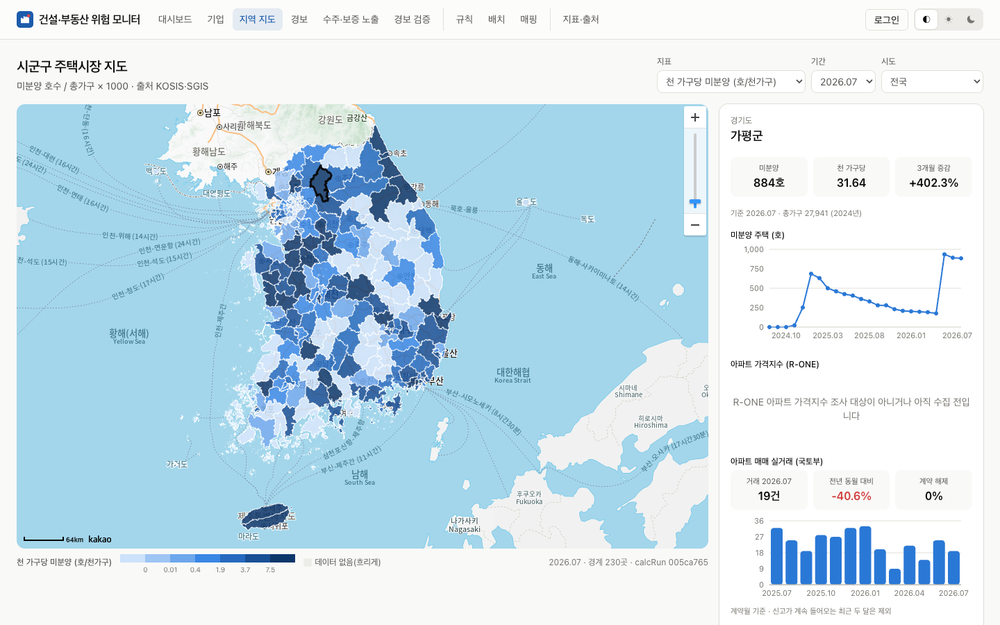

<table>
<tr>
<td width="50%">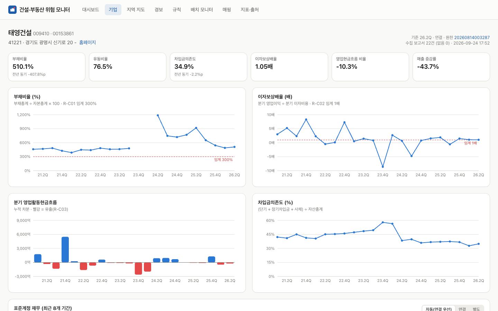<br><sub><b>기업 상세</b> · 태영건설: 2023Q4 자본잠식(값 없음) → 2024Q1 부채비율 1,200% (워크아웃)</sub></td>
<td width="50%">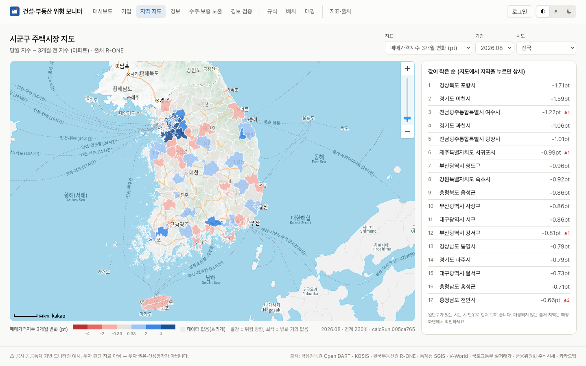<br><sub><b>지역 지도</b> · 아파트 매매가격지수 3개월 변화 (빨강 = 하락, 흐리게 = 조사 대상 아님)</sub></td>
</tr>
<tr>
<td width="50%">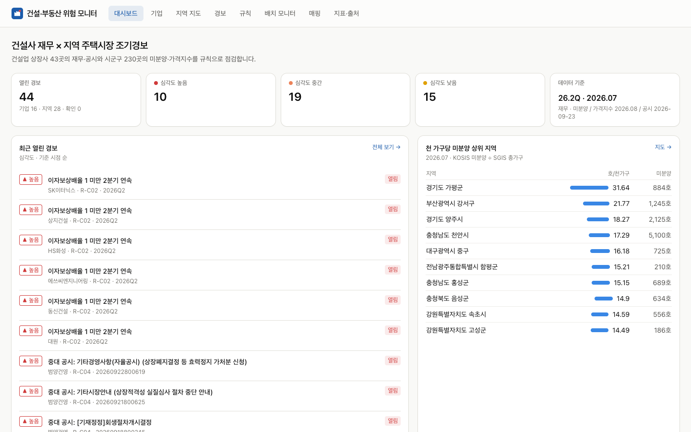<br><sub><b>대시보드</b> · 열린 경보(심각도별), 최근 경보, 미분양 상위 지역, 배치 상태</sub></td>
<td width="50%">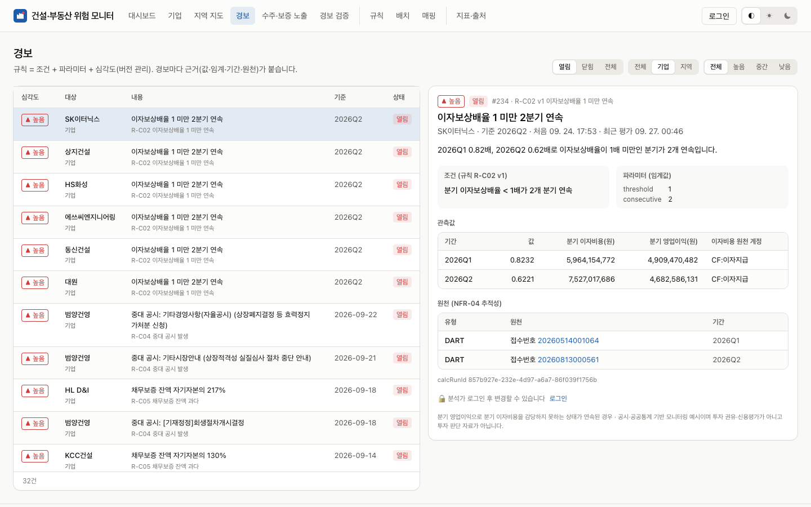<br><sub><b>경보</b> · 조건 · 파라미터 · 관측값 · 원천(통계표·접수번호) · calcRunId</sub></td>
</tr>
<tr>
<td>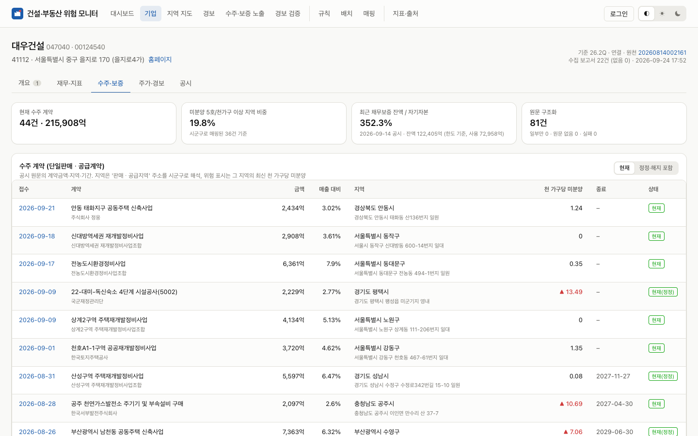<br><sub><b>수주·보증</b> · 공급계약 공시 원문의 공사 지역·금액 × 그 지역 미분양, 채무보증 잔액(원문 주석의 '한도 기준' 표시)</sub></td>
<td>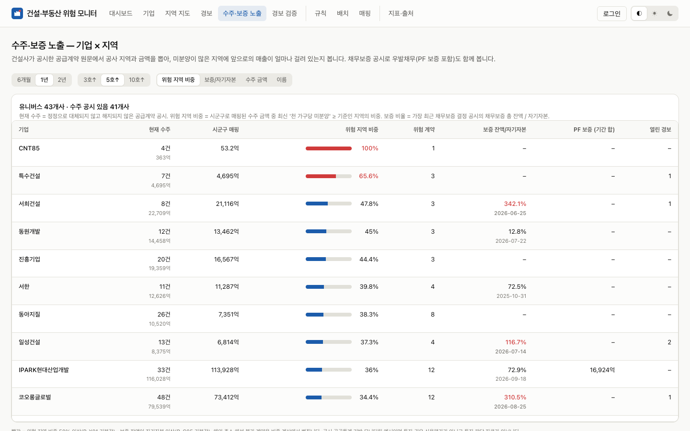<br><sub><b>수주·보증 노출</b> · 기업별 위험 지역 수주 비중 · 보증 잔액/자기자본 · PF 보증</sub></td>
</tr>
<tr>
<td>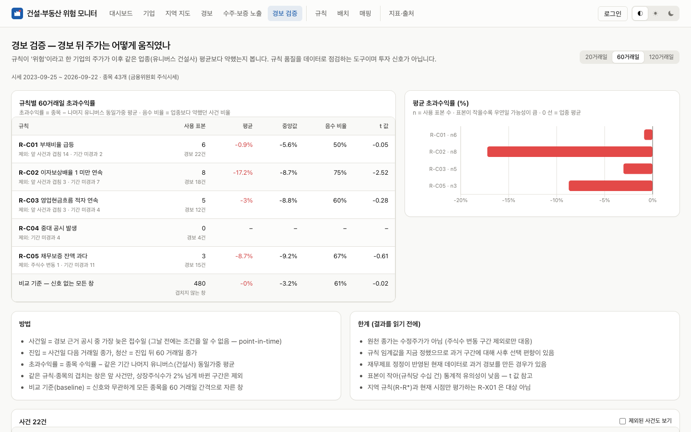<br><sub><b>경보 검증</b> · 규칙별 경보 뒤 60거래일 초과수익률 (point-in-time, 비교 기준 · 한계 함께)</sub></td>
<td>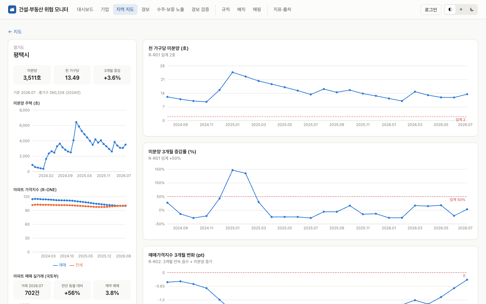<br><sub><b>지역 상세</b> · 아파트 실거래(거래량 · 전년 동월 대비 · 해제율) · 이 지역에 걸린 수주</sub></td>
</tr>
<tr>
<td>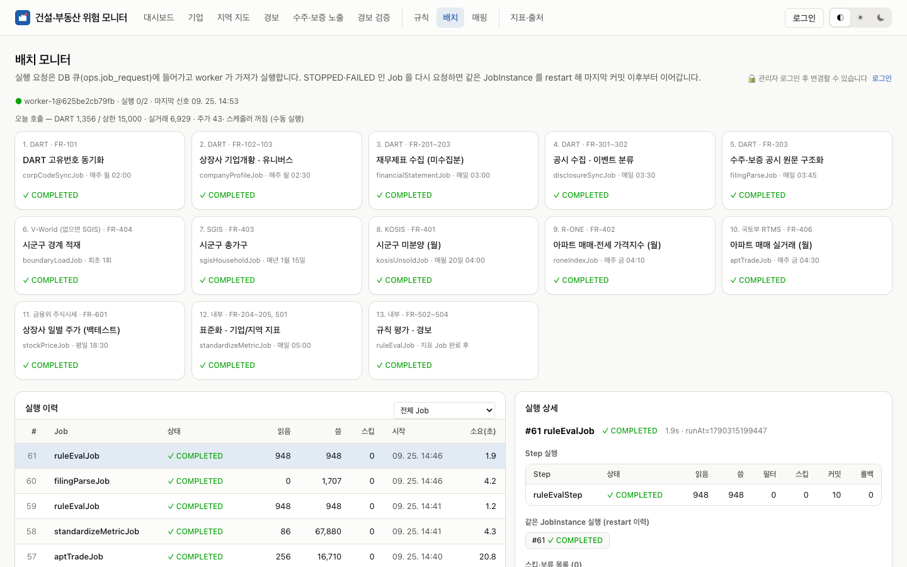<br><sub><b>배치 모니터</b> · 요청 큐 · worker 하트비트 · 실행 이력 · Step · 스킵 · restart 이력</sub></td>
<td>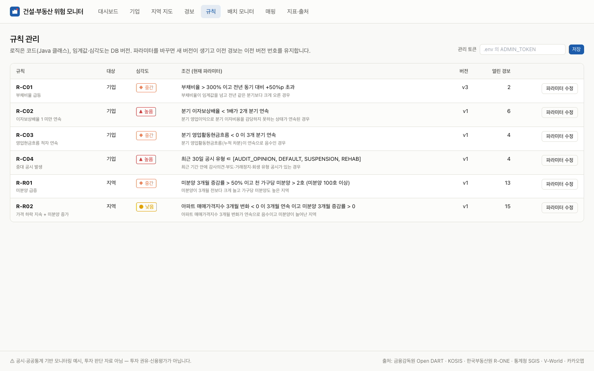<br><sub><b>규칙</b> · 파라미터를 바꾸면 새 버전(누가 바꿨는지 기록), 이전 경보는 이전 버전 번호 유지</sub></td>
</tr>
</table>

<sub>2026-09-25 로컬 실데이터(DART 43개사 2021Q1~2026Q2 · 공시 원문 1,313건 · 실거래 110만 건 · 주가 3년 · KOSIS · R-ONE · SGIS · V-World · 카카오 지도)로 찍은 화면입니다. 다시 찍으려면 스택을 띄운 뒤
`cd web && CAPTURE=1 E2E_CHANNEL=chrome npx playwright test capture`.</sub>

---

## 이 프로젝트에서 보여 주려는 것

| 주제 | 구현 | 확인 방법 |
|---|---|---|
| **재시작 가능한 배치** | 10개 Job 모두 Spring Batch 6. 청크 트랜잭션, STOPPED·FAILED 는 같은 JobInstance 로 restart, 완료된 Step 은 건너뜀 | `FinancialStatementJobIT` — 청크 도중 실패 → restart → 중복 0, 이미 받은 조합 재호출 0 |
| **외부 API 한도 준수** | DART 020(요청 제한)·일일 상한(기본 15,000) → `setTerminateOnly()` 로 현재 청크 커밋 후 STOPPED, 다음 실행에서 이어감 | 020 모의 응답 테스트 · 일일 상한 테스트 |
| **재시작 지점 설계** ([ADR-008](docs/adr/008-restart-from-db-state.md)) | 대상 집합이 실행마다 바뀌는 Job 은 ExecutionContext 오프셋 대신 DB 수집 상태에서 '미수집 조합'을 다시 계산 | 재시작 후 WireMock 호출 수 검증 |
| **회계 데이터 표준화** | 원천 불변(`fs_raw`) → 표준계정 12개(`fs_std`), account_id 우선 · 계정명 정규식 · **재무상태표 부채 구간(유동/비유동) 판별** · 순액/액면 중복 제거 · 대체 규칙, 누적 → 분기 차분(Q2 = 반기누적 − Q1). 43개사 927개 기간 회계 항등식 일치 | `AccountStandardizerTest` · **실제 DART 응답 골든 테스트** · `QuarterAndPeriodTest` |
| **서로 다른 지역 코드 체계 통합** | KOSIS(시 단위)·SGIS(일반구)·R-ONE(권역 경로)을 기준 시군구로 매핑. 2026-07 광주·전남 통합, 인천 행정체제 개편까지 실측 반영 | 매핑률 KOSIS 98.8% · R-ONE 100% · SGIS 98.8%, 미매핑 6건은 모두 사유 기록 |
| **설명 가능한 규칙 엔진** | 로직 = Java 클래스, 임계값 = DB 버전. 경보 멱등키(규칙·버전·대상·시점), 근거 JSON, 자동 CLOSED(RESOLVED·SUPERSEDED·RULE_CHANGED·EXPIRED) | `RuleEvaluatorTest` · `RuleEvalJobIT` |
| **추적성** | 지표·경보 → 표준계정 → 원천 행 → DART 접수번호 / 통계표 ID → 수집 run(`collect_run`) · 계산 run(`calc_run`) | 경보 근거의 `sources` · `calcRunId` |
| **API · worker 분리, DB 실행 요청 큐** ([ADR-012](docs/adr/012-api-worker-queue.md)) | API 는 요청만 넣고(202), worker 가 `FOR UPDATE SKIP LOCKED` 로 가져가 실행. 부분 유니크 인덱스로 중복 요청 409, advisory lock 으로 프로세스 간 중복 시작 차단, worker 등록부(하트비트)로 죽은 worker 의 요청만 정리. API 컨테이너에는 외부 API 키가 없음 | `JobRequestQueueIT` — 동시 claim 정확히 1회 · 요청 체인 · **서로 다른 Job 동시 시작(실데이터에서 발견한 SERIALIZABLE 충돌 재현 → 수정)** |
| **보안** ([ADR-013](docs/adr/013-security.md) · [014](docs/adr/014-db-least-privilege.md)) | 세션(Redis, HttpOnly·SameSite=Strict) + CSRF(`csrf.spa()`), 역할(ANALYST·ADMIN), 스크립트용 서비스 토큰, 로그인 잠금, IP 레이트리밋, **거부된 시도까지 남는 감사 로그**, CSP 등 보안 헤더, 단일 진입점(web), **DML 전용 DB 계정 · 추가 전용 감사 테이블**, 읽기 전용 컨테이너 · capability 제거 | `SecurityIT` · `LeastPrivilegeIT` · E2E · k6 로 429 확인 · CI 의 gitleaks · CodeQL · Trivy |
| **공시 원문 구조화** ([ADR-016](docs/adr/016-filing-structuring.md)) | document.xml 원문을 그대로 보관 + 파서 버전 → 서식이 다른 유가·코스닥·자율공시·정정·해지를 '항목 경로'로 파싱. 파서를 고치면 **API 호출 0건으로 1,313건 재파싱(3.8초)** | 실제 원문 7건 `FilingParserTest` · `FilingJobIT` |
| **기업 × 지역 교차 신호** | 공사 지역 주소 → 시군구(정확 대조만, 추정 없음) → 그 지역 미분양과 결합해 R-X01, 채무보증 잔액으로 R-C05, 실거래 거래량 급감 + 미분양 증가로 R-R03 | `ExposureRulesTest` · `AddressRegionMatcherTest` |
| **경보의 사후 검증** ([ADR-017](docs/adr/017-stock-backtest.md)) | 경보 근거 공시가 공개된 날 다음 거래일부터 20·60·120거래일 업종 대비 초과수익률. 수정주가가 아닌 원천 종가 → 주식수 변동 구간 제외, 겹침 제외, 비교 기준 분포 · t 값 · 한계 표시 | `EventStudyTest` |
| **성능 · 관측** ([ADR-018](docs/adr/018-observability.md)) | 외부 API Step 청크 안 가상 스레드 동시 처리(호출 간격·일일 상한은 스레드 안전하게 유지), 실거래 월 파티션, Redis 캐시. Prometheus 지표(외부 API 제공기관별 지연·결과) · ECS 로그 · Grafana | k6 50 VU: **445 req/s · API p95 176 ms · 오류 0** |
| **실데이터 검증** | 8개 출처 실데이터로 전체 배치를 돌리고 문제 40건을 재현 → 수정 → 회귀 테스트로 고정 (재시작 누락, 좀비 실행, 순액·액면 이중 공시, 공시 오탐, 동시 시작 직렬화 충돌, 자율공시 서식 …) | [docs/VERIFICATION.md](docs/VERIFICATION.md) |

---

## 1. 처음 실행하기 (맥 · Docker Desktop)

```bash
cd ~/Projects/buildrisk-radar
cp .env.example .env      # 외부 API 키 입력 — 비밀값(ADMIN_PASSWORD · DB · Redis · Grafana)은 make 가 무작위로 채움
make smoke                # 키가 실제로 동작하는지 확인
make up                   # db · redis · api · worker · web 기동 (처음 빌드 약 3~4분)
make regions              # 지역: 경계 → 총가구 → 미분양 → 가격지수 → 실거래 → 지표 → 규칙
make batch-all            # 전체: DART 고유번호 → 기업개황 → 재무제표 → 공시 → 원문 구조화 → … → 주가 (처음 1~2시간)
open http://localhost:3400   # 조회는 로그인 없이, 변경은 admin / .env 의 ADMIN_PASSWORD
make obs                  # (선택) Prometheus :9490 · Grafana :3401
```

`.env` 에 넣는 값 (**값 뒤에 줄 끝 주석을 달지 마세요** — docker compose 가 값으로 읽습니다):

| 변수 | 발급처 | 없으면 |
|---|---|---|
| `DART_API_KEY` | Open DART 인증키 (40자) | 기업·재무·공시 Job 이 "키 없음"으로 건너뜀 |
| `KOSIS_API_KEY` | KOSIS 공유서비스 사용자 인증키 | 미분양 없음 |
| `REB_API_KEY` | 한국부동산원 R-ONE Open API 인증키 | 가격지수 없음 (키 없이 부르면 샘플 5건뿐이라 호출하지 않음) |
| `SGIS_CONSUMER_KEY` / `SGIS_CONSUMER_SECRET` | SGIS 서비스 ID / 보안 Key | 총가구 없음 (경계도 V-World 가 없으면 SGIS 로 대체하므로 필요) |
| `VWORLD_API_KEY` · `VWORLD_DOMAIN` | V-World 인증키와 등록한 서비스 URL | 경계를 **SGIS 행정구역 경계로 대체** ([ADR-010](docs/adr/010-boundary-source.md)) |
| `DATA_GO_KR_KEY` | 공공데이터포털 일반 인증키 — **아파트 매매 실거래가 · 주식시세 두 API 모두 활용신청 승인 필요** | 실거래·주가 Job 이 "키 없음" |
| `NEXT_PUBLIC_KAKAO_JS_KEY` | 카카오 JavaScript 키 (플랫폼 Web 도메인에 `http://localhost:3400` 등록) | 지도가 **SVG 단계구분도**로 대체 표시 |
| `ADMIN_PASSWORD` · `ANALYST_PASSWORD` | 화면 로그인 (12자 이상, `make up` 이 자동 생성) | 로그인 불가 (조회는 가능) |
| `ADMIN_TOKEN` | 스크립트용 서비스 토큰 `X-Admin-Token` (자동 생성) | 스크립트로 변경 불가 |
| `DB_APP_PASSWORD` · `REDIS_PASSWORD` · `GRAFANA_ADMIN_PASSWORD` | 자동 생성 | compose 가 기동을 거부 (값이 필요하다고 안내) |

그 밖의 명령: `make job JOB=financialStatementJob` (한 Job, STOPPED 면 이어서) · `make status` · `make test` · `make e2e` · `make load` · `make ratelimit` · `make logs` · `make psql` · `make reset`

| 주소 | 내용 |
|---|---|
| http://localhost:3400 | 화면 — **유일한 외부 진입점** (api 포트는 열지 않음) |
| http://localhost:3400/swagger-ui/index.html | API 문서 (springdoc, web 프록시 경유) |
| http://localhost:3401 · :9490 | Grafana · Prometheus (`make obs`) |

---

## 2. 아키텍처

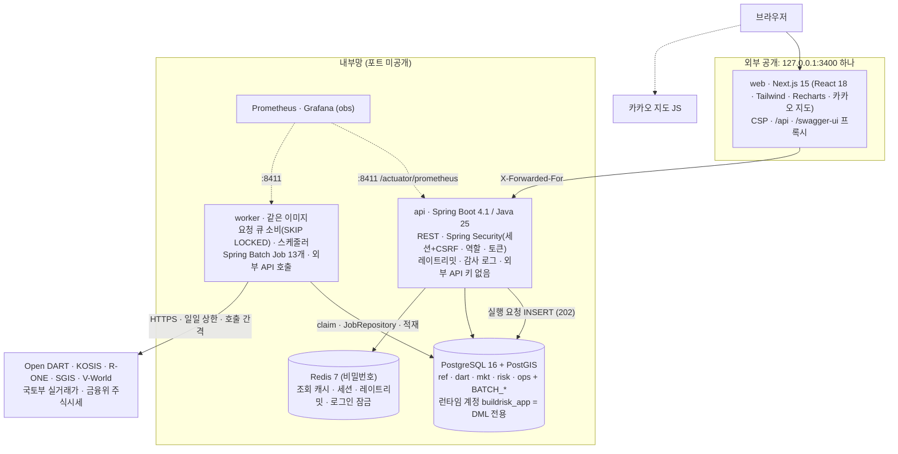

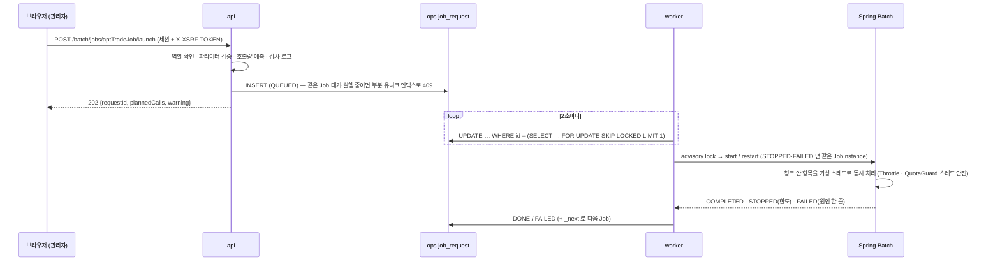

자세한 설계 결정은 [docs/adr](docs/adr/README.md) (ADR 19건).

### 기술 스택

| 영역 | 선택 | 메모 |
|---|---|---|
| 애플리케이션 | **Java 25** (가상 스레드) · **Spring Boot 4.1.1** · Spring Batch 6 · JdbcClient · Flyway · springdoc · jsoup | 3.4 는 OSS 지원 종료 → 4.1 (U-5, [ADR-009](docs/adr/009-boot41-jdbcclient.md)) |
| 보안 | **Spring Security 7** (세션 + `csrf.spa()` · 역할 · 서비스 토큰) · **Spring Session Redis** · BCrypt | [ADR-013](docs/adr/013-security.md) |
| 저장 | PostgreSQL 16 + PostGIS 3.6 | 경계 · 실거래 월 파티션 · 마이그레이션/런타임 계정 분리 ([ADR-014](docs/adr/014-db-least-privilege.md)) |
| 캐시 · 세션 | Redis 7 | 세대 키 `br:gen` 무효화 · 세션 · 레이트리밋 · 로그인 잠금 |
| 화면 | Next.js 15 (Pages Router) · React 18 · TypeScript · Tailwind · Recharts 3 · 카카오 지도 | 접근성 탭 · 좁은 화면 메뉴 · 역할에 따른 버튼 · CSP |
| 관측 | Micrometer → Prometheus · Grafana · ECS 구조화 로그 | 관리 포트 8411 분리 ([ADR-018](docs/adr/018-observability.md)) |
| 테스트 | JUnit 6 · Testcontainers 2 (PostGIS · Redis) · WireMock · MockMvc · Playwright · **k6** | 백엔드 139개 · E2E 13개 · 부하 · 레이트리밋 |
| 도구 | Python 3.11 (표준 라이브러리) | 외부 API 키 스모크 · 골든 fixture 캡처 (`tools/smoke.py`) |
| 운영 · CI | Docker Compose(읽기 전용 · cap_drop · no-new-privileges) · Makefile · GitHub Actions | 테스트 · gitleaks · **CodeQL** · **Trivy** · Dependabot |
| 도입하지 않음 | Kafka/CDC · ClickHouse · Kubernetes | 이유와 도입 조건: [ADR-011](docs/adr/011-out-of-scope-infra.md) |

---

## 3. 배치 Job

| # | Job | 주기 (KST) | Reader → Processor → Writer | 청크 / 스킵 / 재시작 | 요구사항 |
|---|---|---|---|---|---|
| 1 | `corpCodeSyncJob` | 매주 월 02:00 | Zip 다운로드 → **StAX 스트리밍** → `ref.company` UPSERT (modify_date 변경분만) | 1000 / 형식 오류 skip / 읽은 건수부터 | FR-101 |
| 2 | `companyProfileJob` | 매주 월 02:30 | 상장사(키셋 페이징) → company.json → 업종코드 → **유니버스 판정 + 변경 이력** | 50 / 013 skip / 미처리분을 DB 에서 다시 계산 | FR-102~103 |
| 3 | `financialStatementJob` | 매일 03:00 | 미수집 조합 → fnlttSinglAcntAll(CFS→OFS) → `fs_raw` | 20 / 013 NO_DATA / 020 → STOPPED | FR-201~203 |
| 4 | `disclosureSyncJob` | 매일 03:30 | 유니버스 × 최근 N일 list.json → 키워드 분류 → `disclosure` + 전체 재분류 | 20 | FR-301~302 |
| 5 | `boundaryLoadJob` | 최초 1회 | V-World(없으면 SGIS) 경계 → `ref.region` → 일반구 → 시 합성 · 단순화 | 50 | FR-404 |
| 6 | `sgisHouseholdJob` | 매년 1월 | SGIS 총가구 → 지역 매핑 → `region_stat` | 200 | FR-403 |
| 7 | `kosisUnsoldJob` | 매월 20일 | KOSIS 미분양 36개월(6개월씩 — 4만 셀 제한) → 매핑 → `region_stat` | 200 | FR-401 |
| 8 | `roneIndexJob` | 매주 금 | R-ONE 매매·전세지수 (시리즈 × 월 × 페이지) → 매핑 → `region_stat` | 200 | FR-402 |
| 9 | `standardizeMetricJob` | 매일 05:00 | `fs_raw` → `fs_std` → 기업 지표 / 지역 통계 → 지역 지표 | Step 3개, 실패 Step 만 재실행 | FR-204~205, 501 |
| 10 | `ruleEvalJob` | 9번 완료 후 | 사용 중 규칙(최신 버전) × 대상 → 경보 UPSERT + 근거 | 100 | FR-502~504 |
| 11 | `filingParseJob` | 매일 03:45 | 수주·보증 공시 → document.xml(Zip, 5MB 상한) → **원문 보관** + 파싱 → 지역 해석 → 정정·해지 연결 | 20 · 동시 4 / 파서 버전이 낮으면 **호출 없이 재파싱** | FR-303 · [ADR-016](docs/adr/016-filing-structuring.md) |
| 12 | `aptTradeJob` | 매주 금 04:30 | (시군구 × 계약월) → 실거래(XML, 1,000건씩) → 월 파티션 교체 → 화면 단위 집계 | 20 · 동시 4 / 수집 원장에서 재시작 · 최근 달부터 | FR-406 · [ADR-015](docs/adr/015-apt-trade.md) |
| 13 | `stockPriceJob` | 평일 18:30 | 유니버스 종목 → 주식시세(JSON) 마지막 저장일 다음 날부터 | 10 · 동시 4 | FR-601 · [ADR-017](docs/adr/017-stock-backtest.md) |

실행은 모두 **요청 큐**를 거칩니다 — 화면·API 요청, 스케줄러(`BATCH_SCHEDULING_ENABLED=true`), 체인(`_next`: 지표 → 규칙) 모두 같은 경로로 기록됩니다.
프로세스가 죽어 STARTED 로 남은 실행은 하트비트(Step `last_updated`)가 10분 넘게 멈추면 다음 실행 요청 때 자동으로 FAILED 정리 후 restart 되고,
배치 모니터의 **멈춘 실행 정리** 버튼(`POST /batch/executions/{id}/recover`)으로 즉시 정리할 수도 있습니다.

---

## 4. 지표 · 규칙

**기업 지표** — 부채비율 · 유동비율 · 차입금의존도 · 이자보상배율(분기) · 영업현금흐름 비율 · 분기 영업현금흐름 · 전년 동기 대비(%p).
분모가 0·음수(자본잠식)이거나 계정이 없으면 값 대신 상태 코드(`NEG_EQUITY` · `ZERO_DENOM` · `MISSING`).

**지역 지표** — 미분양 · 천 가구당 미분양 · 미분양 3개월 증감률 · 매매/전세지수 3개월 변화 · 전세·매매 괴리 ·
**아파트 매매 거래 · 거래량 전년 동월 대비 · 계약 해제 비율 · ㎡당 중위 매매가 · 전년 동월 대비** (신고가 들어오는 중인 최근 두 달 제외).

| 규칙 | 대상 | 조건 (파라미터 기본값) | 심각도 |
|---|---|---|---|
| R-C01 | 기업 | 부채비율 > 300% 이고 전년 동기 대비 +50%p 초과 | MEDIUM |
| R-C02 | 기업 | 분기 이자보상배율 < 1 이 2개 분기 연속 | HIGH |
| R-C03 | 기업 | 분기 영업활동현금흐름 < 0 이 3개 분기 연속 | MEDIUM |
| R-C04 | 기업 | 최근 30일 공시 유형 ∈ {감사의견, 부도, 거래정지, 회생} | HIGH |
| R-R01 | 지역 | 미분양 3개월 증감률 > 50% 이고 천 가구당 > 2호 (미분양 100호 이상) | MEDIUM |
| R-R02 | 지역 | 매매가격지수 3개월 변화 < 0 이 3개월 연속 이고 미분양 증가 | LOW |
| R-R03 | 지역 | 거래량 전년 동월 대비 ≤ −40% 이고 미분양 3개월 증감률 ≥ +10% (전년 같은 달 거래 30건 이상) | MEDIUM |
| R-C05 | 기업 | 가장 최근 채무보증 결정 공시의 채무보증 총 잔액 / 자기자본 ≥ 100% (원문 주석의 '한도 기준' 여부 · 사용 잔액을 근거에 표시) | HIGH |
| R-X01 | 기업 × 지역 | 최근 1년 현재 수주 금액 중 천 가구당 미분양 ≥ 5 지역 비중 ≥ 50% (해당 계약 2건 이상) | MEDIUM |

R-R01 의 `minUnsoldUnits` 는 구현 중 추가한 파라미터입니다 — 미분양 0 → 3호 같은 작은 기저의 증감률 잡음을 거릅니다.

---

## 5. API (`/api/v1`, 전체 목록은 Swagger)

| # | 메서드 · 경로 | 설명 |
|---|---|---|
| 1 | `GET /companies` | 유니버스 목록 (q, sort=alerts·debtRatio·interestCoverage·name) |
| 2 | `GET /companies/{corpCode}` | 기업 요약 (최신 지표 · 열린 경보 · 고지) — Redis 캐시 |
| 3 | `GET /companies/{corpCode}/financials` | 표준계정 시계열 (fsDiv=AUTO·CFS·OFS, 누적 + 분기값) |
| 4 | `GET /companies/{corpCode}/metrics` | 지표 시계열 (값 · 상태 · 구성요소 · 원천 rceptNo) |
| 5 | `GET /companies/{corpCode}/disclosures` | 공시 타임라인 (eventType 필터) |
| 6 | `GET /regions` | 시군구 목록 + 지표 (sido, metric, period) |
| 7 | `GET /regions/geojson` | 단계구분도 GeoJSON (simplify m) — Redis 캐시 |
| 8 | `GET /regions/{regionCd}/series` | 지역 통계·지표 시계열 · 출처 코드 매핑 |
| 9 | `GET /alerts` | 경보 목록 (targetType, severity, status, since) |
| 10 | `GET /alerts/{alertId}` | 경보 상세 · 근거 |
| 11 | `PATCH /alerts/{alertId}` 🔑 | 상태 변경 (ACK · OPEN, 누가 확인했는지 기록) |
| 12 | `GET /rules` · `PUT /rules/{ruleCode}` 🔒 | 규칙 조회 / 파라미터 변경 → 새 버전 (created_by) |
| 13 | `GET /mapping/unmapped` · `POST`/`DELETE /mapping/account-rules` 🔒 · `PUT /mapping/region-codes` 🔒 | 미매핑 계정·지역 · 매핑률 · 계정 규칙 추가·삭제 · 지역 수동 매핑 |
| 14 | `GET /batch/executions` · `/batch/executions/{id}` · `POST /batch/executions/{id}/recover` 🔒 | Job 실행 이력 · Step · 스킵 · restart 이력 · 멈춘 실행 정리 |
| 15 | `POST /batch/jobs/{jobName}/launch` 🔒 · `GET /batch/requests` | 실행 요청을 큐에 넣음 (202 + requestId · 예상 호출 수) · 요청 이력 |
| 16 | `GET /companies/{corpCode}/filings` · `/prices` | 수주 계약 · 채무보증(원문 구조화) · 일별 종가 + 경보 공개일 |
| 17 | `GET /regions/{regionCd}/contracts` · `GET /exposure` | 지역에 걸린 수주 · 기업별 노출 요약 |
| 18 | `GET /backtest?horizon=20·60·120` | 규칙별 경보 뒤 초과수익률 · 비교 기준 · 방법 · 한계 |
| 19 | `POST /auth/login` · `POST /auth/logout` · `GET /auth/me` · `GET /admin/audit` 🔒 | 세션 로그인 · 현재 사용자 · 감사 로그 |
| + | `GET /dashboard` · `GET /meta` | 대시보드 요약 · 지표 정의·출처 |

조회(GET)는 공개. 🔑 = ANALYST 이상, 🔒 = ADMIN — 브라우저는 세션 쿠키 + `X-XSRF-TOKEN` 헤더, 스크립트는 `X-Admin-Token`.
오류 형식은 `{code, message, traceId}` (`400 VALIDATION_ERROR`, `401 UNAUTHORIZED · LOGIN_FAILED`, `403 FORBIDDEN · CSRF_INVALID`, `404 …_NOT_FOUND`, `405`, `409 JOB_ALREADY_RUNNING`, `415`, `429 TOO_MANY_REQUESTS`(+ Retry-After), `502 UPSTREAM_ERROR`), 모든 응답에 `X-Trace-Id` 헤더.

---

## 6. 데이터 모델 (6 스키마 · 31 테이블 + 파티션 · BATCH_*)

| 스키마 | 테이블 |
|---|---|
| `ref` | company · universe_override · universe_history · std_account · account_map · region · region_code_map |
| `dart` | fs_fetch(수집 상태) · fs_raw(원천 불변) · fs_std(표준화 파생) · disclosure · **filing_doc(원문 + 파서 버전) · contract · contract_termination · guarantee** |
| `mkt` | stat_series · region_stat · region_metric · **apt_trade(계약월 연 단위 파티션 2015~2030 + DEFAULT) · apt_trade_fetch · stock_daily** |
| `risk` | company_metric · rule(버전 · created_by) · alert(멱등키 · 근거 CHECK · acked_by) |
| `ops` | collect_run · calc_run · api_quota(제공기관별 일일 호출) · skip_log · **job_request(실행 요청 큐) · worker(등록부) · audit_log(추가 전용)** · BATCH_* |
| `public` | flyway_schema_history (런타임 계정 접근 불가) |

마이그레이션: `V1~V14` + `afterMigrate`(런타임 계정 권한 동기화). seed(`seed/*.csv · *.yml`)는 기동 시 멱등 동기화합니다.

---

## 7. 테스트 · 측정값

```bash
make test        # 백엔드 139개 (단위·골든 + Testcontainers 통합) + 웹 타입 검사
make e2e         # Playwright 13개 (스택이 떠 있어야 함, 관리자 로그인 시나리오 포함)
make load        # k6 부하 (50 VU · 90초, web 프록시 경유)
make ratelimit   # 한 클라이언트가 분당 한도를 넘으면 429
```

| 층 | 대상 | 내용 |
|---|---|---|
| 단위 | 표준화(구간 규칙·순액/액면·대체 규칙) · 분기 차분 · 지표 · 지역 매칭 · 공시 분류 · 유니버스 · 규칙 6종 | JUnit 파라미터화 테스트 |
| 골든 | 실제 DART 응답 6건 (대형·중견·코스닥, 연결·별도) | 회계 항등식 · 차입금 ≤ 부채 · 스냅샷 (`-Dgolden.update=true` 로 갱신) |
| 배치 통합 | `financialStatementJob` · `companyProfileJob` · 좀비 실행 | 청크 도중 실패 → restart 중복 0 · 013 → OFS · 020 → STOPPED → 이어감 · 일일 상한 · restart 누락 0 · 하트비트 복구 |
| 규칙 통합 | `ruleEvalJob` | 재평가 멱등 · ACK 유지 · 자동 RESOLVED · 규칙 버전 변경 시 RULE_CHANGED |
| API | MockMvc + 시드 DB | 400·401·404·405·415 오류 형식 · traceId · 규칙 새 버전 · 202 큐 · 지역 수동 매핑 · 근거 없는 경보 DB 거부 |
| 큐 · 동시성 | `JobRequestQueueIT` | 중복 요청 409 · 동시 claim 정확히 1회 · 체인 · 서로 다른 Job 동시 시작 5회 반복 |
| 보안 | `SecurityIT` · `LeastPrivilegeIT` | CSRF · 역할 · 세션 쿠키 속성 · 잠금 · 레이트리밋 · 감사 · DB DDL/감사 변조 거부 |
| 신규 수집 | `AptTradeJobIT` · `FilingJobIT` · `StockAndInsightIT` · 파서·주소·사건 연구 단위 | 일반구 → 화면 단위 집계 · 0건 달 · 동시 호출에서 maxCalls 정확히 · 트래픽 초과 STOPPED · 원문 재파싱 호출 0 · 해지 연결 |
| E2E | Playwright | 대시보드 고지 · 지도 · 경보 근거 · 배치 모니터 · 테마 · 보안 헤더 · 로그인/권한 · 노출 · 경보 검증 · 탭 키보드 · 좁은 화면 메뉴 |

| 측정 (NFR-06, 로컬 M 시리즈 맥, 실데이터 2026-09-24) | 결과 | 목표 |
|---|---|---|
| 기업 상세 43곳 (캐시 없음) | p50 7 ms · p95 8 ms | p95 < 300 ms |
| 기업 상세 (Redis 캐시) | p50 5 ms · p95 6 ms | p95 < 300 ms |
| 지도 GeoJSON 230곳 (첫 요청 / 캐시) | 84 ms / p95 48 ms · 1.95 MB (gzip 546 KB) | p95 < 1 s |
| 기업 목록 · 재무 · 지표 | p95 15 · 7 · 8 ms | — |
| DART 고유번호 119,447건 적재 (StAX 스트리밍) | 4.2 s | — |
| 기업개황 3,994건 (DART 호출 간격 200 ms) | 약 12분 | — |
| 빈 DB → `make up` → `make regions` | 49 s + 18 s | README 대로 첫 화면 (FR-701) |
| **k6 50 VU · 90 s (web 프록시 경유, 조회 API 9종 혼합)** | **445 req/s · 40,235건 · 오류 0 · API p95 176 ms · GeoJSON p95 243 ms** | API p95 < 300 ms · 지도 < 1 s |
| 레이트리밋 (20 VU · 20 s, 한 IP) | 1,200건 200 · 29,243건 429(Retry-After) — 한도와 정확히 일치 | 분당 1,200 |
| 실거래 수집 6,400 (시군구×월) · 110만 행 | 420 s (6,417 호출, 동시 4) | 일일 상한 9,000 이내 |
| 청크 안 동시 호출 A/B (실거래 256 호출) | 순차 23.3 s → 동시 4 17.8 s (−24%) — 이후는 공급자 보호용 호출 간격(60 ms ≈ 16.7건/s)이 천장 | — |
| 공시 원문 1,313건 수집·구조화 | 263 s (DART 호출 간격 200 ms 가 천장) · **파서 개정 후 재파싱 3.8 s · 호출 0** | — |
| 주가 43종목 × 3년 (31,138행) | 27 s (43 호출) | — |

데이터 품질·적재 결과와 실데이터·정적 분석으로 찾은 문제 40건은 [docs/VERIFICATION.md](docs/VERIFICATION.md).

## 8. 설계서 미결정 사항 → 결과

| ID | 항목 | 결과 |
|---|---|---|
| U-1 | KOSIS 미분양 통계표 | **orgId 116 · tblId DT_MLTM_2082 · itmId 13103871087T1**, C1 = 시도 약칭, C2 = 시군구(시 단위), '계' 행 제외. 한 요청 4만 셀 제한 → 6개월씩 분할 (2026-09-24 실측) |
| U-2 | R-ONE 가격지수 STATBL_ID | **A_2024_00045** (월) 매매가격지수_아파트 · **A_2024_00050** (월) 전세가격지수_아파트, ITM_ID 100001 (목록 API 로 확인) |
| U-3 | V-World 경계 | `LT_C_ADSIGG_INFO` 사용 (269개, **2026-07 광주·전남 통합·인천 개편 반영됨**) + SGIS 경계 대체 경로 ([ADR-010](docs/adr/010-boundary-source.md)) — 실제로 SGIS → V-World 전환·재적재 검증 |
| U-4 | 건설업 업종코드 범위 | **KSIC 41(종합건설) + 421(기반조성·시설물 축조 전문공사업)**, 현재 상장(유가·코스닥)만, 아이에스동서 수동 포함 → **43개사**. 422~424(전기·설비·실내건축)는 제외 |
| U-5 | Spring Boot 버전 | **4.1.1** ([ADR-009](docs/adr/009-boot41-jdbcclient.md)) |
| U-6 | 이자비용 가용성 | 매핑률 **95.4%** (손익계산서 본문 → 없으면 현금흐름표 '이자의 지급'). '금융원가'는 환차손 등이 섞여 쓰지 않고 MISSING. 어느 출처를 썼는지 경보 근거에 표시 |

## 9. 한계

- 회계연도가 12월이 아닌 회사는 사업연도를 그대로 기간 키로 씁니다(건설업 상장사는 대부분 12월 결산).
- 이자보상배율의 이자비용을 현금흐름표 '이자의 지급'으로 대신한 회사는 이자 지급 시점에 따라 분기 값이 출렁일 수 있습니다(근거에 원천 표시).
- 차입금을 '금융부채'로 묶어 공시한 회사(예: GS건설)는 리스부채 등이 섞인 값으로 차입금의존도를 계산합니다(대체 규칙, 근거에 원천 표시).
- 인천 2026-07 개편 신설 구는 KOSIS 시계열이 202607부터라 3개월 증감률이 아직 없고, SGIS 2024 총가구는 폐지된 옛 구 기준이라 천 가구당 미분양이 비어 있습니다(사유 기록).
- 공시 이벤트 분류는 보고서명 키워드 사전 기반이라 본문 내용은 보지 않습니다(범위 밖).
- 가구 수는 SGIS 2024 총조사 값을 이후 월에도 씁니다.
- 공시의 공사 지역은 주소 표기를 경계 이름과 정확히 대조할 때만 시군구로 봅니다 — 1,122건 중 922건(82%) 시군구, 나머지는 시도만 · 해외 · 해석 불가로 두고 비중 계산에서 뺍니다.
- 같은 회사가 이름이 같은 다른 계약을 공시하면 '현재 계약'에서 하나로 합쳐질 수 있고, 수집 기간(1년) 전에 체결된 계약의 해지는 원 계약과 연결되지 않습니다.
- 채무보증 '총 잔액'은 회사에 따라 보증 한도(미사용분 포함)입니다(원문 170건 중 85건 주석). 규칙은 공시값 그대로 쓰고, 주석으로 사용 잔액을 계산할 수 있는 32건만 근거에 함께 표시합니다.
- 백테스트는 표본이 작고(규칙당 수~수십 건) 수정주가가 아니며 임계값을 사후에 정했습니다 — 규칙 점검용이지 투자 신호가 아닙니다.

## 10. 폴더 구조

```
buildrisk-radar/
├─ app/                      Spring Boot 4.1 (Gradle, Java 25 툴체인)
│  └─ src/main/java/com/buildrisk/radar/
│     ├─ api/                컨트롤러 · 조회 서비스(노출 · 백테스트 포함) · DTO
│     ├─ batch/              jobs/ (Job 13개) · queue/ (요청 큐 · worker · 등록부) · support/ (Launcher · QuotaGuard · CLI · 스케줄러)
│     ├─ domain/             account · metric · rule(+rules/) · region(주소 해석) · disclosure · universe · filing(원문 파서) · market · backtest
│     ├─ adapters/           dart · kosis · rone · sgis · vworld · datagokr(실거래 · 주식시세) · common(한도 · 재시도 · 간격 · 지표)
│     └─ common/             설정 · 역할(api/worker) · security(세션 · CSRF · 토큰 · 레이트리밋 · 감사) · 오류 규약 · traceId · 캐시 · seed
├─ app/src/main/resources/db/migration/   V1 … V14 · afterMigrate(런타임 계정 권한)
├─ app/src/test/             단위 · Testcontainers 통합 · WireMock fixture (DART 재무 · 공시 원문 · 실거래 · 주가 실응답)
├─ web/                      Next.js 15 (pages · components · lib(auth · api) · e2e)
├─ ops/                      prometheus · grafana(프로비저닝 대시보드) · k6(부하 · 레이트리밋)
├─ seed/                     표준계정 · 매핑 규칙 · 업종코드 · 이벤트 사전 · 규칙 · 통계 시리즈 · 지역 별칭
├─ tools/smoke.py            외부 API 키 스모크 · 골든 fixture 캡처
├─ docs/adr/                 설계 결정 기록 19건
├─ docs/VERIFICATION.md      실데이터 검증 기록 (적재 결과 · 품질 · 찾아서 고친 문제 40건 · 성능 · 보안 확인)
├─ docker-compose.yml · Makefile · .env.example · .github/ (ci · codeql · dependabot)
```
