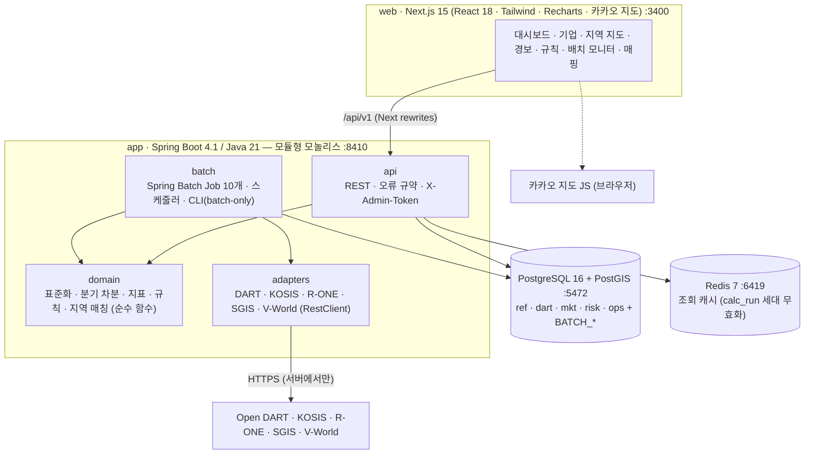
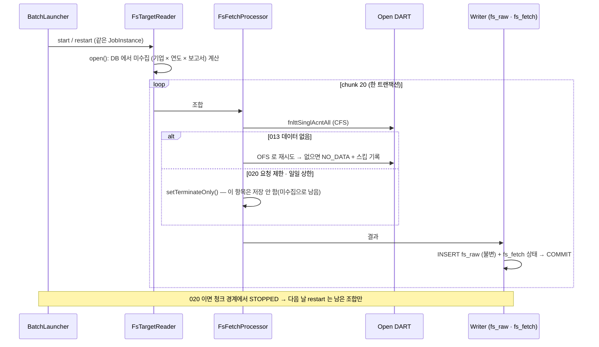

# 건설·부동산 위험 모니터 (BuildRisk Radar)

건설사 재무·공시 × 지역 주택시장 **조기경보** 서비스.
Open DART 의 건설업 상장사 재무제표·공시를 **Spring Batch** 로 수집·표준화해 건전성 지표를 계산하고,
KOSIS 미분양 · 한국부동산원 가격지수 · SGIS 총가구와 함께 **버전 관리되는 규칙**으로 평가해
**근거(evidence)가 붙은 경보**를 기업 화면과 시군구 지도로 보여 주는 로컬 모니터링 서비스입니다.

> ⚠ 공시·공공통계 기반 **모니터링 예시**이며 투자 권유·신용평가가 아니고 투자 판단 자료가 아닙니다. 모든 화면·API 응답에 이 문구가 붙습니다.
> 규칙 임계값은 업계 공식 기준이 아니라 탐색용 기본값입니다.


<table>
<tr>
<td width="50%"><br><sub><b>기업 상세</b> · 태영건설: 2023Q4 자본잠식(값 없음) → 2024Q1 부채비율 1,200% (워크아웃)</sub></td>
<td width="50%"><br><sub><b>지역 지도</b> · 아파트 매매가격지수 3개월 변화 (빨강 = 하락, 흐리게 = 조사 대상 아님)</sub></td>
</tr>
<tr>
<td width="50%"><br><sub><b>대시보드</b> · 열린 경보(심각도별), 최근 경보, 미분양 상위 지역, 배치 상태</sub></td>
<td width="50%"><br><sub><b>경보</b> · 조건 · 파라미터 · 관측값 · 원천(통계표·접수번호) · calcRunId</sub></td>
</tr>
<tr>
<td><br><sub><b>배치 모니터</b> · Spring Batch 메타 테이블 기반 실행 이력 · Step · 스킵 · restart 이력</sub></td>
<td><br><sub><b>규칙</b> · 파라미터를 바꾸면 새 버전, 이전 경보는 이전 버전 번호 유지</sub></td>
</tr>
</table>

<sub>2026-09-24 로컬 실데이터(DART 43개사 2021Q1~2026Q2 · KOSIS 미분양 · R-ONE 가격지수 · SGIS 총가구 · V-World 경계 · 카카오 지도)로 찍은 화면입니다. 다시 찍으려면 스택을 띄운 뒤
`cd web && CAPTURE=1 E2E_CHANNEL=chrome npx playwright test capture`.</sub>

---

## 이 프로젝트에서 보여 주려는 것

| 주제 | 구현 | 확인 방법 |
|---|---|---|
| **재시작 가능한 배치** | 10개 Job 모두 Spring Batch 6. 청크 트랜잭션, STOPPED·FAILED 는 같은 JobInstance 로 restart, 완료된 Step 은 건너뜀 | `FinancialStatementJobIT` — 청크 도중 실패 → restart → 중복 0, 이미 받은 조합 재호출 0 |
| **외부 API 한도 준수** | DART 020(요청 제한)·일일 상한(기본 15,000) → `setTerminateOnly()` 로 현재 청크 커밋 후 STOPPED, 다음 실행에서 이어감 | 020 모의 응답 테스트 · 일일 상한 테스트 |
| **재시작 지점 설계** ([ADR-008](docs/adr/008-restart-from-db-state.md)) | 대상 집합이 실행마다 바뀌는 Job 은 ExecutionContext 오프셋 대신 DB 수집 상태에서 '미수집 조합'을 다시 계산 | 재시작 후 WireMock 호출 수 검증 |
| **회계 데이터 표준화** | 원천 불변(`fs_raw`) → 표준계정 12개(`fs_std`), account_id 우선 · 계정명 정규식 · **재무상태표 부채 구간(유동/비유동) 판별** · 순액/액면 중복 제거 · 대체 규칙, 누적 → 분기 차분(Q2 = 반기누적 − Q1). 43개사 927개 기간 회계 항등식 일치 | `AccountStandardizerTest` · **실제 DART 응답 골든 테스트** · `QuarterAndPeriodTest` |
| **서로 다른 지역 코드 체계 통합** | KOSIS(시 단위)·SGIS(일반구)·R-ONE(권역 경로)을 기준 시군구로 매핑. 2026-07 광주·전남 통합, 인천 행정체제 개편까지 실측 반영 | 매핑률 KOSIS 98.8% · R-ONE 100% · SGIS 98.8%, 미매핑 6건은 모두 사유 기록 |
| **설명 가능한 규칙 엔진** | 로직 = Java 클래스, 임계값 = DB 버전. 경보 멱등키(규칙·버전·대상·시점), 근거 JSON, 자동 CLOSED(RESOLVED·SUPERSEDED·RULE_CHANGED·EXPIRED) | `RuleEvaluatorTest` · `RuleEvalJobIT` |
| **추적성** | 지표·경보 → 표준계정 → 원천 행 → DART 접수번호 / 통계표 ID → 수집 run(`collect_run`) · 계산 run(`calc_run`) | 경보 근거의 `sources` · `calcRunId` |
| **실데이터 검증** | 6개 API 실데이터로 전체 배치를 돌리고 27개 문제를 재현 → 수정 → 회귀 테스트로 고정 (재시작 누락 50건, 좀비 실행, 순액·액면 이중 공시, 공시 오탐 …) | [docs/VERIFICATION.md](docs/VERIFICATION.md) |

---

## 1. 처음 실행하기 (맥 · Docker Desktop)

```bash
cd ~/Projects/buildrisk-radar
cp .env.example .env      # 키 입력 (make up 이 .env 가 없으면 만들고 ADMIN_TOKEN 도 생성)
make smoke                # 키가 실제로 동작하는지 확인
make up                   # db · redis · app · web 기동 (처음 빌드 약 2~3분)
make regions              # 지역: 경계 → 총가구 → 미분양 → 가격지수 → 지표 → 규칙 (약 1분)
make batch-all            # 전체: DART 고유번호 → 기업개황 → 재무제표 → 공시 → … (처음 30~60분)
open http://localhost:3400
```

`.env` 에 넣는 값 (**값 뒤에 줄 끝 주석을 달지 마세요** — docker compose 가 값으로 읽습니다):

| 변수 | 발급처 | 없으면 |
|---|---|---|
| `DART_API_KEY` | Open DART 인증키 (40자) | 기업·재무·공시 Job 이 "키 없음"으로 건너뜀 |
| `KOSIS_API_KEY` | KOSIS 공유서비스 사용자 인증키 | 미분양 없음 |
| `REB_API_KEY` | 한국부동산원 R-ONE Open API 인증키 | 가격지수 없음 (키 없이 부르면 샘플 5건뿐이라 호출하지 않음) |
| `SGIS_CONSUMER_KEY` / `SGIS_CONSUMER_SECRET` | SGIS 서비스 ID / 보안 Key | 총가구 없음 (경계도 V-World 가 없으면 SGIS 로 대체하므로 필요) |
| `VWORLD_API_KEY` · `VWORLD_DOMAIN` | V-World 인증키와 등록한 서비스 URL | 경계를 **SGIS 행정구역 경계로 대체** ([ADR-010](docs/adr/010-boundary-source.md)) |
| `NEXT_PUBLIC_KAKAO_JS_KEY` | 카카오 JavaScript 키 (플랫폼 Web 도메인에 `http://localhost:3400` 등록) | 지도가 **SVG 단계구분도**로 대체 표시 |
| `ADMIN_TOKEN` | 관리 API 토큰 (`make up` 이 자동 생성) | 규칙 변경·배치 실행 불가 |

그 밖의 명령: `make job JOB=financialStatementJob` (한 Job, STOPPED 면 이어서) · `make status` · `make test` · `make e2e` · `make logs` · `make psql` · `make reset`

| 주소 | 내용 |
|---|---|
| http://localhost:3400 | 화면 (대시보드 · 기업 · 지역 지도 · 경보 · 규칙 · 배치 모니터 · 매핑 · 지표 정의) |
| http://localhost:8410/swagger-ui | API 문서 (springdoc) |

---

## 2. 아키텍처





자세한 설계 결정은 [docs/adr](docs/adr/README.md) (ADR 11건).

### 기술 스택

| 영역 | 선택 | 메모 |
|---|---|---|
| 애플리케이션 | Java 21 · **Spring Boot 4.1.1** · Spring Batch 6 · JdbcClient · Flyway · springdoc | 3.4 는 OSS 지원 종료 → 4.1 (U-5, [ADR-009](docs/adr/009-boot41-jdbcclient.md)) |
| 저장 | PostgreSQL 16 + PostGIS 3.6 | 경계 저장 · `ST_Transform` · 단순화 · GeoJSON 생성 |
| 캐시 | Redis 7 | 세대 키 `br:gen` INCR 한 번으로 calc_run 단위 무효화 |
| 화면 | Next.js 15 (Pages Router) · React 18 · TypeScript · Tailwind · Recharts 3 · 카카오 지도 | 카카오 실패 시 SVG 단계구분도 대체 · 시스템/라이트/다크 테마 전환(상단 바 오른쪽, 브라우저에 저장) |
| 테스트 | JUnit 6 · Testcontainers 2 (PostGIS · Redis) · WireMock · MockMvc · Playwright | 백엔드 82개 (실제 DART 응답 골든 6건 포함) · E2E 5개 |
| 도구 | Python 3.11 (표준 라이브러리) | 외부 API 키 스모크 · 골든 fixture 캡처 (`tools/smoke.py`) |
| 운영 | Docker Compose · Makefile · GitHub Actions | 모든 포트 127.0.0.1 바인딩 |
| 도입하지 않음 | Kafka/CDC · ClickHouse · Kubernetes | 이유와 도입 조건: [ADR-011](docs/adr/011-out-of-scope-infra.md) |

---

## 3. 배치 Job

| # | Job | 주기 (KST) | Reader → Processor → Writer | 청크 / 스킵 / 재시작 | 요구사항 |
|---|---|---|---|---|---|
| 1 | `corpCodeSyncJob` | 매주 월 02:00 | Zip 다운로드 → **StAX 스트리밍** → `ref.company` UPSERT (modify_date 변경분만) | 1000 / 형식 오류 skip / 읽은 건수부터 | FR-101 |
| 2 | `companyProfileJob` | 매주 월 02:30 | 상장사(키셋 페이징) → company.json → 업종코드 → **유니버스 판정 + 변경 이력** | 50 / 013 skip / 미처리분을 DB 에서 다시 계산 | FR-102~103 |
| 3 | `financialStatementJob` | 매일 03:00 | 미수집 조합 → fnlttSinglAcntAll(CFS→OFS) → `fs_raw` | 20 / 013 NO_DATA / 020 → STOPPED | FR-201~203 |
| 4 | `disclosureSyncJob` | 매일 03:30 | 유니버스 × 최근 N일 list.json → 키워드 분류 → `disclosure` + 전체 재분류 | 20 | FR-301~302 |
| 5 | `boundaryLoadJob` | 최초 1회 | V-World(없으면 SGIS) 경계 → `ref.region` → 일반구 → 시 합성 · 단순화 | 50 | FR-404 |
| 6 | `sgisHouseholdJob` | 매년 1월 | SGIS 총가구 → 지역 매핑 → `region_stat` | 200 | FR-403 |
| 7 | `kosisUnsoldJob` | 매월 20일 | KOSIS 미분양 36개월(6개월씩 — 4만 셀 제한) → 매핑 → `region_stat` | 200 | FR-401 |
| 8 | `roneIndexJob` | 매주 금 | R-ONE 매매·전세지수 (시리즈 × 월 × 페이지) → 매핑 → `region_stat` | 200 | FR-402 |
| 9 | `standardizeMetricJob` | 매일 05:00 | `fs_raw` → `fs_std` → 기업 지표 / 지역 통계 → 지역 지표 | Step 3개, 실패 Step 만 재실행 | FR-204~205, 501 |
| 10 | `ruleEvalJob` | 9번 완료 후 | 사용 중 규칙(최신 버전) × 대상 → 경보 UPSERT + 근거 | 100 | FR-502~504 |

스케줄러는 `BATCH_SCHEDULING_ENABLED=true` 일 때만 켜집니다(로컬 데모는 수동 실행 권장).
프로세스가 죽어 STARTED 로 남은 실행은 하트비트(Step `last_updated`)가 10분 넘게 멈추면 다음 실행 요청 때 자동으로 FAILED 정리 후 restart 되고,
배치 모니터의 **멈춘 실행 정리** 버튼(`POST /batch/executions/{id}/recover`)으로 즉시 정리할 수도 있습니다.

---

## 4. 지표 · 규칙

**기업 지표** — 부채비율 · 유동비율 · 차입금의존도 · 이자보상배율(분기) · 영업현금흐름 비율 · 분기 영업현금흐름 · 전년 동기 대비(%p).
분모가 0·음수(자본잠식)이거나 계정이 없으면 값 대신 상태 코드(`NEG_EQUITY` · `ZERO_DENOM` · `MISSING`).

**지역 지표** — 미분양 · 천 가구당 미분양 · 미분양 3개월 증감률 · 매매/전세지수 3개월 변화 · 전세·매매 괴리.

| 규칙 | 대상 | 조건 (파라미터 기본값) | 심각도 |
|---|---|---|---|
| R-C01 | 기업 | 부채비율 > 300% 이고 전년 동기 대비 +50%p 초과 | MEDIUM |
| R-C02 | 기업 | 분기 이자보상배율 < 1 이 2개 분기 연속 | HIGH |
| R-C03 | 기업 | 분기 영업활동현금흐름 < 0 이 3개 분기 연속 | MEDIUM |
| R-C04 | 기업 | 최근 30일 공시 유형 ∈ {감사의견, 부도, 거래정지, 회생} | HIGH |
| R-R01 | 지역 | 미분양 3개월 증감률 > 50% 이고 천 가구당 > 2호 (미분양 100호 이상) | MEDIUM |
| R-R02 | 지역 | 매매가격지수 3개월 변화 < 0 이 3개월 연속 이고 미분양 증가 | LOW |

R-R01 의 `minUnsoldUnits` 는 구현 중 추가한 파라미터입니다 — 미분양 0 → 3호 같은 작은 기저의 증감률 잡음을 거릅니다.

---

## 5. API (`/api/v1`, 전체 목록은 Swagger)

| # | 메서드 · 경로 | 설명 |
|---|---|---|
| 1 | `GET /companies` | 유니버스 목록 (q, sort=alerts·debtRatio·interestCoverage·name) |
| 2 | `GET /companies/{corpCode}` | 기업 요약 (최신 지표 · 열린 경보 · 고지) — Redis 캐시 |
| 3 | `GET /companies/{corpCode}/financials` | 표준계정 시계열 (fsDiv=AUTO·CFS·OFS, 누적 + 분기값) |
| 4 | `GET /companies/{corpCode}/metrics` | 지표 시계열 (값 · 상태 · 구성요소 · 원천 rceptNo) |
| 5 | `GET /companies/{corpCode}/disclosures` | 공시 타임라인 (eventType 필터) |
| 6 | `GET /regions` | 시군구 목록 + 지표 (sido, metric, period) |
| 7 | `GET /regions/geojson` | 단계구분도 GeoJSON (simplify m) — Redis 캐시 |
| 8 | `GET /regions/{regionCd}/series` | 지역 통계·지표 시계열 · 출처 코드 매핑 |
| 9 | `GET /alerts` | 경보 목록 (targetType, severity, status, since) |
| 10 | `GET /alerts/{alertId}` | 경보 상세 · 근거 |
| 11 | `PATCH /alerts/{alertId}` | 상태 변경 (ACK · OPEN) |
| 12 | `GET /rules` · `PUT /rules/{ruleCode}` 🔒 | 규칙 조회 / 파라미터 변경 → 새 버전 |
| 13 | `GET /mapping/unmapped` · `POST`/`DELETE /mapping/account-rules` 🔒 · `PUT /mapping/region-codes` 🔒 | 미매핑 계정·지역 · 매핑률 · 계정 규칙 추가·삭제 · 지역 수동 매핑 |
| 14 | `GET /batch/executions` · `/batch/executions/{id}` · `POST /batch/executions/{id}/recover` 🔒 | Job 실행 이력 · Step · 스킵 · restart 이력 · 멈춘 실행 정리 |
| 15 | `POST /batch/jobs/{jobName}/launch` 🔒 | Job 수동 실행 (202, STOPPED·FAILED 면 restart) |
| + | `GET /dashboard` · `GET /meta` | 대시보드 요약 · 지표 정의·출처 |

🔒 = `X-Admin-Token` 필요. 오류 형식은 `{code, message, traceId}` (`400 VALIDATION_ERROR · RULE_PARAM_INVALID`, `401`, `404 COMPANY_NOT_FOUND …`, `405`, `409 JOB_ALREADY_RUNNING`, `415`, `502 UPSTREAM_ERROR`), 모든 응답에 `X-Trace-Id` 헤더.

---

## 6. 데이터 모델 (6 스키마 · 21 테이블 + BATCH_*)

| 스키마 | 테이블 |
|---|---|
| `ref` | company · universe_override · universe_history · std_account · account_map · region · region_code_map |
| `dart` | fs_fetch(수집 상태) · fs_raw(원천 불변) · fs_std(표준화 파생) · disclosure |
| `mkt` | stat_series · region_stat · region_metric |
| `risk` | company_metric · rule(버전) · alert(멱등키 · 근거 CHECK) |
| `ops` | collect_run · calc_run · api_quota(일일 호출) · skip_log · BATCH_* (Spring Batch 메타) |
| `public` | flyway_schema_history |

마이그레이션: `app/src/main/resources/db/migration/V1~V6`. seed(`seed/*.csv · *.yml`)는 기동 시 멱등 동기화합니다.

---

## 7. 테스트 · 측정값

```bash
make test   # 백엔드 82개 (단위·골든 + Testcontainers 통합) + 웹 타입 검사
make e2e    # Playwright 5개 (스택이 떠 있어야 함)
```

| 층 | 대상 | 내용 |
|---|---|---|
| 단위 | 표준화(구간 규칙·순액/액면·대체 규칙) · 분기 차분 · 지표 · 지역 매칭 · 공시 분류 · 유니버스 · 규칙 6종 | JUnit 파라미터화 테스트 |
| 골든 | 실제 DART 응답 6건 (대형·중견·코스닥, 연결·별도) | 회계 항등식 · 차입금 ≤ 부채 · 스냅샷 (`-Dgolden.update=true` 로 갱신) |
| 배치 통합 | `financialStatementJob` · `companyProfileJob` · 좀비 실행 | 청크 도중 실패 → restart 중복 0 · 013 → OFS · 020 → STOPPED → 이어감 · 일일 상한 · restart 누락 0 · 하트비트 복구 |
| 규칙 통합 | `ruleEvalJob` | 재평가 멱등 · ACK 유지 · 자동 RESOLVED · 규칙 버전 변경 시 RULE_CHANGED |
| API | MockMvc + 시드 DB | 400·401·404·405·415 오류 형식 · traceId · 규칙 새 버전 · 202 실행 · 지역 수동 매핑 · 근거 없는 경보 DB 거부 |
| E2E | Playwright | 대시보드 고지 · 지도 · 경보 근거 · 배치 모니터 · 테마 전환 유지 |

| 측정 (NFR-06, 로컬 M 시리즈 맥, 실데이터 2026-09-24) | 결과 | 목표 |
|---|---|---|
| 기업 상세 43곳 (캐시 없음) | p50 7 ms · p95 8 ms | p95 < 300 ms |
| 기업 상세 (Redis 캐시) | p50 5 ms · p95 6 ms | p95 < 300 ms |
| 지도 GeoJSON 230곳 (첫 요청 / 캐시) | 84 ms / p95 48 ms · 1.95 MB (gzip 546 KB) | p95 < 1 s |
| 기업 목록 · 재무 · 지표 | p95 15 · 7 · 8 ms | — |
| DART 고유번호 119,447건 적재 (StAX 스트리밍) | 4.2 s | — |
| 기업개황 3,994건 (DART 호출 간격 200 ms) | 약 12분 | — |
| 빈 DB → `make up` → `make regions` | 49 s + 18 s | README 대로 첫 화면 (FR-701) |

데이터 품질·적재 결과와 실데이터로 찾은 문제 27건은 [docs/VERIFICATION.md](docs/VERIFICATION.md).

## 8. 설계서 미결정 사항 → 결과

| ID | 항목 | 결과 |
|---|---|---|
| U-1 | KOSIS 미분양 통계표 | **orgId 116 · tblId DT_MLTM_2082 · itmId 13103871087T1**, C1 = 시도 약칭, C2 = 시군구(시 단위), '계' 행 제외. 한 요청 4만 셀 제한 → 6개월씩 분할 (2026-09-24 실측) |
| U-2 | R-ONE 가격지수 STATBL_ID | **A_2024_00045** (월) 매매가격지수_아파트 · **A_2024_00050** (월) 전세가격지수_아파트, ITM_ID 100001 (목록 API 로 확인) |
| U-3 | V-World 경계 | `LT_C_ADSIGG_INFO` 사용 (269개, **2026-07 광주·전남 통합·인천 개편 반영됨**) + SGIS 경계 대체 경로 ([ADR-010](docs/adr/010-boundary-source.md)) — 실제로 SGIS → V-World 전환·재적재 검증 |
| U-4 | 건설업 업종코드 범위 | **KSIC 41(종합건설) + 421(기반조성·시설물 축조 전문공사업)**, 현재 상장(유가·코스닥)만, 아이에스동서 수동 포함 → **43개사**. 422~424(전기·설비·실내건축)는 제외 |
| U-5 | Spring Boot 버전 | **4.1.1** ([ADR-009](docs/adr/009-boot41-jdbcclient.md)) |
| U-6 | 이자비용 가용성 | 매핑률 **95.4%** (손익계산서 본문 → 없으면 현금흐름표 '이자의 지급'). '금융원가'는 환차손 등이 섞여 쓰지 않고 MISSING. 어느 출처를 썼는지 경보 근거에 표시 |

## 9. 한계

- 회계연도가 12월이 아닌 회사는 사업연도를 그대로 기간 키로 씁니다(건설업 상장사는 대부분 12월 결산).
- 이자보상배율의 이자비용을 현금흐름표 '이자의 지급'으로 대신한 회사는 이자 지급 시점에 따라 분기 값이 출렁일 수 있습니다(근거에 원천 표시).
- 차입금을 '금융부채'로 묶어 공시한 회사(예: GS건설)는 리스부채 등이 섞인 값으로 차입금의존도를 계산합니다(대체 규칙, 근거에 원천 표시).
- 인천 2026-07 개편 신설 구는 KOSIS 시계열이 202607부터라 3개월 증감률이 아직 없고, SGIS 2024 총가구는 폐지된 옛 구 기준이라 천 가구당 미분양이 비어 있습니다(사유 기록).
- 공시 이벤트 분류는 보고서명 키워드 사전 기반이라 본문 내용은 보지 않습니다(범위 밖).
- 가구 수는 SGIS 2024 총조사 값을 이후 월에도 씁니다.

## 10. 폴더 구조

```
buildrisk-radar/
├─ app/                      Spring Boot 4.1 (Gradle, Java 21 툴체인)
│  └─ src/main/java/com/buildrisk/radar/
│     ├─ api/                컨트롤러 · 조회 서비스 · DTO
│     ├─ batch/              jobs/ (Job 10개) · support/ (Launcher · QuotaGuard · CLI · 스케줄러)
│     ├─ domain/             account · metric · rule(+rules/) · region · disclosure · universe
│     ├─ adapters/           dart · kosis · rone · sgis · vworld · common(한도·재시도·간격)
│     └─ common/             설정 · 오류 규약 · traceId · 관리 토큰 · Redis 캐시 · seed
├─ app/src/main/resources/db/migration/   V1 스키마 … V5
├─ app/src/test/             단위 · Testcontainers 통합 · WireMock fixture
├─ web/                      Next.js 15 (pages · components · lib · e2e)
├─ seed/                     표준계정 · 매핑 규칙 · 업종코드 · 이벤트 사전 · 규칙 · 통계 시리즈 · 지역 별칭
├─ tools/smoke.py            외부 API 키 스모크 · 골든 fixture 캡처
├─ docs/adr/                 설계 결정 기록 11건
├─ docs/VERIFICATION.md      실데이터 검증 기록 (적재 결과 · 품질 · 찾아서 고친 문제 27건)
├─ docker-compose.yml · Makefile · .env.example · .github/workflows/ci.yml
```
